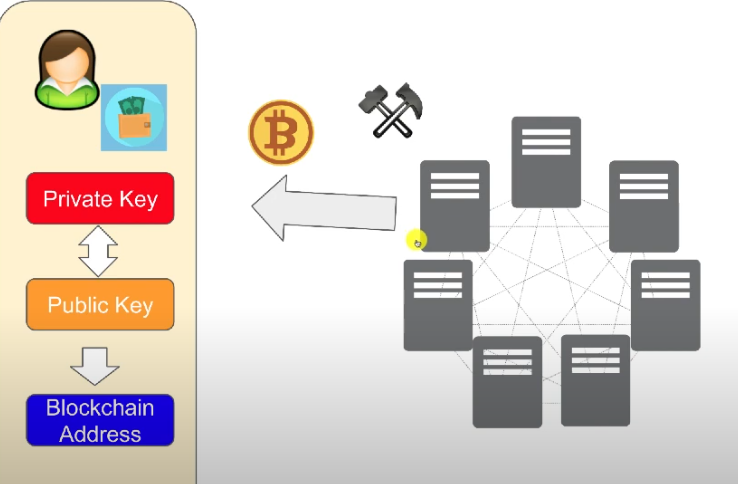
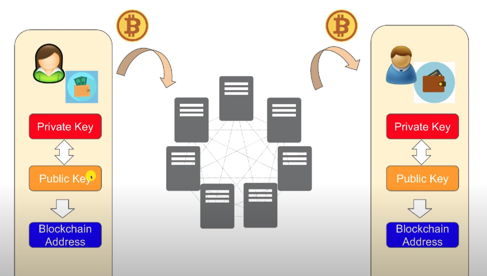
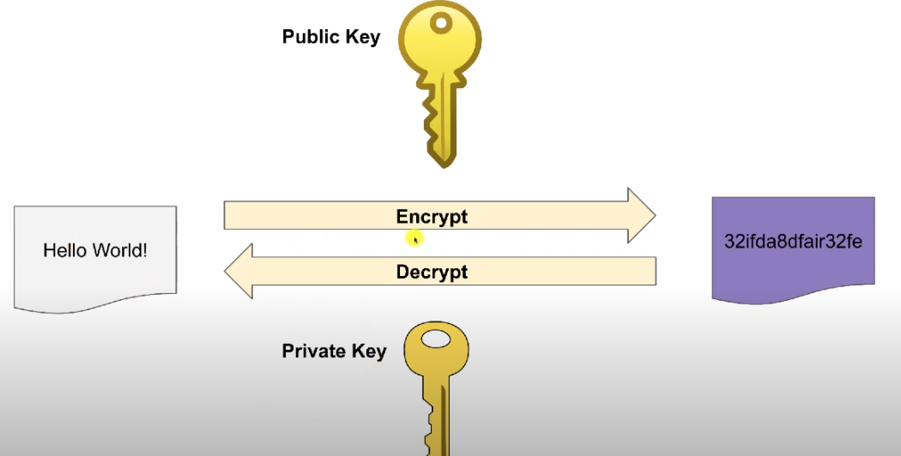
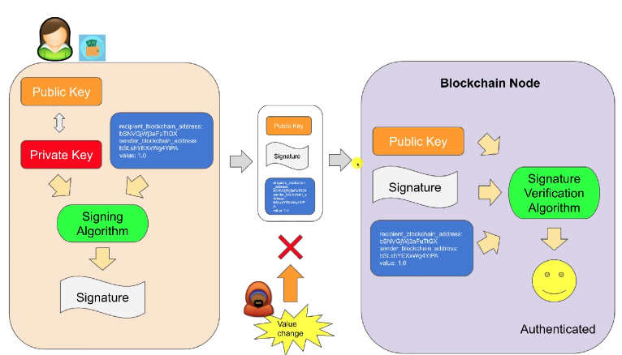
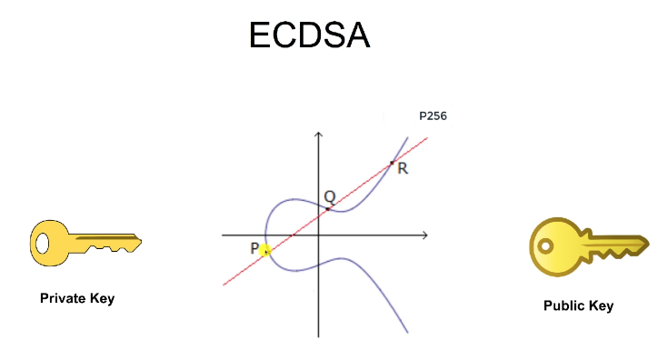

# gobc
Block chain and Design patterns compendium

# Blockchain


In a **blockchain**, a block is a digital container that holds data, such as transactions, and links to previous blocks, forming a chain. Here’s a brief explanation of key components in a block:

1. **Previous Hash**: Each block contains the hash (a cryptographic code) of the previous block. This links blocks together, ensuring that if any block is tampered with, it breaks the chain’s integrity.

2. **Timestamp**: This records the exact time when the block was created, ensuring that the order of blocks is maintained over time.

3. **Nonce**: A random number used in the mining process to solve a cryptographic puzzle. Miners adjust the nonce to find a hash that meets the blockchain's difficulty requirements, securing the network.

4. **Transactions**: A list of transactions within the block, containing details such as sender, receiver, and the amount of cryptocurrency or data being transferred.

Together, these elements secure the blockchain's immutability and transparency.

### Pool of transactions

**We want to move The transactions stored in the "Pool" of the Blockchain into the Transaction's section of the new/latest Block and then Empty the Pool of the Blockchain**. This action occurs during the new Block creation, **i.e. when creating a new Block the transactions of the blockchain Pool are moved into the Block and the transaction Pool is empty for futures Block**.  


---
## Nonce calculation and Proof of Work

In a blockchain context, **Nonce and Proof of Work (PoW) are used to find a solution that meets "specific criteria", like a "hash starting with a certain number of leading zeroes"**.

**Nonce:** A variable that you **increment until you find a hash that meets the difficulty requirement**.
**Proof of Work (PoW):** The **process of hashing the block data with different values of Nonce until a hash with the required number of leading zeroes is found**.


**In blockchain and proof-of-work systems, the process of checking for leading zeros in a block’s hash is essential because it enforces a specific level of computational difficulty**, which serves as a way **"to regulate how quickly" new blocks are added to the chain**.

**Why Leading Zeros?**

1. **Difficulty Control**: The number of leading zeros determines the "difficulty" of finding a valid hash. **The more leading zeros required, the harder it is to find a matching hash**. This is because finding a hash with more leading zeros requires more computations, as **hashes are essentially random outputs based on the input data and nonce**.

2. **Probabilistic Challenge**: **Hashes are deterministic but look random; changing the nonce or any block data produces a completely different hash**. To find a hash with three leading zeros, for instance, **miners must repeatedly alter the nonce and rehash until they find a hash that matches the difficulty target**. This **process takes time and energy**, creating **"a computational challenge" that adds "security" to the network by making "attacks costly"**.

3. **Hexadecimal Representation**: **Hashes are typically shown in hexadecimal form**, where each hex digit represents 4 binary bits. So, **requiring three leading zeros in hex (000...) is equivalent to requiring 12 leading binary zeros (0000 0000 0000)**, which **directly impacts the number of computations needed to find a valid hash**.

4. **Consistency and Fairness**: Setting a difficulty target with leading zeros makes it easy to adjust the challenge for miners as the network grows or shrinks. **Increasing the required number of leading zeros makes it harder, decreasing makes it easier**. This mechanism keeps block times relatively constant, preventing blocks from being mined too quickly or too slowly.

In summary, **the leading zero requirement is a practical way to enforce computational difficulty, create a probabilistic proof-of-work challenge, and maintain a balanced mining rate, ensuring that new blocks are consistently added to the chain**.


---
## Mining reward address



The **Mining process** includes **adding one last transaction that includes the `reward` and `my_block_chain_address` for receiving the reward (including the registered `mining sender address`/server that sends the reward)** into the last Block of the chain, so if the mining is valid, i.e. my system was the 1st to provide the PoW/valid last block for the chain then the reward will be sent to my receipt address.

***Example***
```go
func (bc *blockChain) Mining() bool {
	// The blockChainn sender sends rewards to the blockChain address because of successfull mining:
	bc.CreateAppendTransaction(MINING_SENDER_ADDRESS, bc.BlockChainAddress(), MINING_REWARD)
	nonce := bc.ProofOfWork()
	var b *Block = nil
	if nonce > 0 {
		previousHash := bc.LastBlock().Hash()
		b = bc.CreateAppendBlock(nonce, previousHash)
	}
	return b != nil
}
```

```json
{
  "transactionPool": [],
  "chain": [
    {
      "nonce": 0,
      "prevHash": "131cf374b1f3a1417306bc0f58e12803bab2f0e2c4917a5661faa764139ab952",
      "timeStamp": "2024-10-28T19:19:42.786410824-03:00",
      "transactions": [
        {
          "senderAddress": "genesis_sender_address",
          "receiverAddress": "genesis_recipient_address",
          "amount": 0,
          "timeStamp": "2024-10-28T19:19:42.786301345-03:00"
        }
      ]
    },
    {
      "nonce": 2839,
      "prevHash": "d6c0ac9d09dbf0f76eb4f59ef86f4ce7c82adcbbeb074e90add83b59cf3d91d4",
      "timeStamp": "2024-10-28T19:19:42.833307705-03:00",
      "transactions": [
        {
          "senderAddress": "sender_address_1_flow_A",
          "receiverAddress": "receiver_address_1_flow_A",
          "amount": 1,
          "timeStamp": "2024-10-28T19:19:42.786557314-03:00"
        },
        {
          "senderAddress": "THE_BLOCKCHAIN_MINING_SENDER_ADDRESS",
          "receiverAddress": "MY_BLOCKCHAIN_RECEIPT_ADDRESS_FOR_MINING_REWARD",
          "amount": 1,
          "timeStamp": "2024-10-28T19:19:42.786557771-03:00"
        }
      ]
    }
  ],
  "blockChainAddress": "MY_BLOCKCHAIN_RECEIPT_ADDRESS_FOR_MINING_REWARD"
}
```


---
## Wallets, Private and Public Keys Pairs and Blockchain 

In blockchain technology, **wallets**, **public and private key pairs**, and **blockchain** itself are essential elements that enable secure and decentralized digital transactions.

1. **Wallets**:
   - Digital wallets are tools that store and manage users' cryptocurrencies. **Wallets do Not store the actual coins but instead hold the user’s "cryptographic keys"**, allowing them **to access their funds and authorize transactions on the blockchain**. In other words, when creating a wallet we always need a Private and a Public key pair because the wallet only holds the cryptographic keys.

2. **Public and Private Key Pairs**:
   - Each wallet is associated with a **public key** and a **private key**.
   - The **"public key" functions like an address** that others can see and use to send funds to the wallet, **similar to a bank account number**.
   - The **"private key" is confidential and used to "Sign" transactions**, proving the ownership and control of the wallet. **Losing the private key typically means losing access to the funds permanently.**

3. **Blockchain**:
   - **Blockchain is a distributed ledger technology that records transactions in a secure, transparent, and immutable way (via Chained Blocks)**. **Each transaction is verified by a network of nodes (computers) before being added to a chain of blocks, making the blockchain a secure and tamper-resistant database**.
  
**Together, these components allow users to perform secure peer-to-peer transactions without intermediaries, forming the foundation of "decentralized" finance and other blockchain applications.**







### ECDSA

**ECDSA** (Elliptic Curve Digital Signature Algorithm) is a cryptographic algorithm used to ensure the authenticity and integrity of messages or transactions. It's widely used in blockchain and cryptocurrency systems (like Bitcoin and Ethereum) to secure digital signatures due to its efficiency and strong security. ECDSA is based on **elliptic curve cryptography (ECC)**, which provides similar security levels to traditional cryptography but with smaller key sizes, making it faster and less resource-intensive.

**How ECDSA Works:**

1. **Key Generation**: 
   - Each user generates a **public-private key pair**. The **private key** is a randomly generated number, while the **public key is derived from the private key using elliptic curve mathematics**.

   

2. **Signing a Message**:
   - When a user wants to sign a message or transaction, ECDSA uses the private key to create a unique **digital signature** for that specific message. This signature is unique to the message and private key, so it cannot be reused for another message.

3. **Verifying a Signature**:
   - The receiver (or any verifier) can check the authenticity of the signature using the sender's public key and the message. If the signature is valid, it proves the message was indeed signed by the owner of the private key, without revealing the private key itself.

**Key Advantages of ECDSA:**

- **Efficient and Lightweight**: ECDSA provides high security with smaller key sizes than traditional algorithms (like RSA), making it ideal for resource-constrained environments.
- **Widely Used in Blockchains**: Blockchains like Bitcoin and Ethereum use ECDSA to secure transactions, as it allows for secure, decentralized digital signatures and verification.

***Example in Blockchain**

When you send a transaction on a blockchain, ECDSA:
- **Uses your private key to sign the transaction, creating a unique signature.**
- **This signature, along with your public key, allows others to verify that you authorized the transaction without exposing your private key.** 

This combination of security and efficiency is why ECDSA is essential in blockchain technology, where performance and data integrity are critical.


---
## SAGA

The **Saga pattern** is a design pattern **used to manage distributed transactions in microservices architectures**. In traditional monolithic systems, a single transaction could be easily managed with ACID properties (Atomicity, Consistency, Isolation, Durability). However, **in a microservices environment, where each service has its own database, it's difficult to maintain a single atomic transaction across multiple services**.

The Saga pattern breaks a distributed transaction into a series of smaller transactions. Each of these smaller transactions updates a service and publishes an event to trigger the next step in the process. If a step fails, a compensating transaction is executed to undo the previous step(s), ensuring that the system remains consistent.

There are two main types of Saga implementations:

1. **Choreography-based Saga**:
   - In this approach, each service involved in the saga publishes an event when a transaction is completed. This event triggers the next service in the process to start its transaction.
   - There is no central orchestrator; instead, each service listens to events and reacts accordingly.
   - This approach is simple but can become complex as the number of services grows, leading to a lot of inter-service communication.

2. **Orchestration-based Saga**:
   - In this approach, a central orchestrator manages the flow of the saga. The orchestrator sends commands to each service, telling them what to do at each step.
   - If a step fails, the orchestrator issues compensating commands to rollback or handle the failure.
   - This approach provides more control but introduces a single point of failure (the orchestrator).

### Key Points:
- **Compensating transactions**: Unlike ACID transactions, Sagas rely on compensating transactions to handle failures, essentially undoing the effects of previous steps.
- **Failure management**: Sagas can handle partial failures by rolling back certain steps, while other steps that have already been completed successfully remain intact.
- **Event-driven**: Sagas often leverage event-driven architectures, making them a good fit for microservices that communicate asynchronously.

**The Saga pattern is widely used in distributed systems where maintaining strong consistency is difficult or impractical, and eventual consistency is acceptable.**


---
### ACID

**ACID** stands for **Atomicity, Consistency, Isolation, and Durability**, which are key properties of a **reliable database transaction system**:

1. **Atomicity**: Ensures that a **transaction is treated as a single, indivisible unit**. Either all operations within the transaction are completed successfully, or none are applied (**commit at the end or rollback**). If any part of the transaction fails, the system rolls back to the state before the transaction started.

2. **Consistency**: **Guarantees that a transaction will bring the database from one valid state to another**, maintaining the defined rules and constraints. **After the transaction, all data will be "correct" and valid**.

3. **Isolation: Ensures that "concurrent" transactions do not interfere with each other**. Each transaction is executed in isolation from others, preventing inconsistencies that could arise from transactions interacting with the same data at the same time.

4. **Durability: Once a transaction is committed, its changes are "permanent"**, even in the case of a system failure. The data is safely stored and will remain intact after the transaction completes.

These properties ensure the reliability and correctness of transactions in databases.


---
### Idempotency

**Idempotency** is a concept in computer science and programming that **refers to the property of an operation where performing it multiple times produces the same result as performing it once**. In other words, no matter how many times you repeat the operation, the outcome remains unchanged after the first successful execution.

### Key Aspects of Idempotency:
1. **Safe Repeated Executions:**
   - An operation is idempotent if calling it multiple times has the same effect as calling it once. This is useful when dealing with unreliable networks or systems that might retry an operation, ensuring that duplicate requests don't cause unintended side effects.

2. **Common in HTTP Methods:**
   - Some HTTP methods are defined as idempotent:
     - **GET:** Always idempotent. Retrieving the same resource multiple times should not modify it.
     - **PUT:** Typically idempotent. Sending the same `PUT` request multiple times updates or creates a resource with the same values.
     - **DELETE:** Ideally idempotent. Deleting the same resource multiple times should not cause errors after the first deletion.
     - **POST:** **Not idempotent** by definition. Sending the same `POST` request multiple times may result in the creation of multiple resources (e.g., creating a new entry in a database).

3. **Practical Example:**
   - Imagine a bank transaction where you send a request to transfer money. If the system retries the transaction due to a network failure, idempotency ensures that multiple identical requests won’t result in multiple transfers of money.

### **Real-World Examples:**
- **Database Updates:**
  - If you send multiple identical updates to a record, idempotency ensures that the state of the database remains the same after the first update. For instance, setting a user’s email to `user@example.com` multiple times will only change it once.
  
- **API Design:**
  - When designing APIs, especially in distributed systems, implementing idempotent endpoints helps avoid accidental duplication or unintended side effects. Many APIs provide an **idempotency key** (e.g., in payment processing), ensuring that multiple submissions of the same request result in only one action.

### **Why Idempotency Matters:**
- **Reliability:** It allows systems to handle failures and retries more gracefully without introducing data corruption or unintended behavior.
- **Consistency:** It ensures that multiple identical operations result in consistent and predictable outcomes.
- **Fault Tolerance:** In distributed systems, where messages or operations might be retried due to timeouts or network issues, idempotency guarantees that retries won’t cause inconsistencies.

In summary, idempotency is a crucial property in ensuring robust, fault-tolerant, and predictable behavior in systems, especially when dealing with network communication or repeated actions.


---
# SAGA PATTERN IN DETAIL

The **SAGA pattern** is a design pattern used to manage distributed transactions in a microservices architecture. It ensures that a long-running business process, which spans across multiple services, either completes successfully or rolls back gracefully, even though traditional ACID transactions are not feasible in distributed systems. It consists of a series of **compensating transactions** and can be implemented using either the **choreography** or **orchestration** approach. Here's a detailed breakdown:

### Key Concepts of the SAGA Pattern

1. **Saga**: A sequence of transactions, where each transaction updates data within a service and publishes an event. If any transaction fails, compensating transactions are invoked to undo the previous steps, ensuring data consistency across services.

2. **Compensating Transaction**: The undo action for a previous step in the saga. It reverses the effects of the successful transactions executed before the failure occurred. Each step in a saga has a corresponding compensating action.

3. **Long-Running Processes**: Sagas are designed for long-running processes where traditional distributed transactions would be too complex or slow due to network latency, service downtime, or failure in large distributed systems.

### Approaches to Implement the SAGA Pattern

#### 1. **Choreography-based SAGA (Event-Driven)**
   - Each microservice involved in the saga listens for events and performs local transactions when appropriate.
   - After a local transaction is successfully completed, the service emits an event, triggering the next step in the process.
   - If any step fails, compensating events are emitted to roll back previous operations.

   **Advantages**:
   - Simple to implement for small sagas.
   - Each service is autonomous, so there is no central point of failure.
   
   **Disadvantages**:
   - Becomes difficult to manage as the number of services increases (hard to track the flow).
   - Event chains can become complex and hard to debug.

   **Example**:
   Consider an e-commerce order processing saga with the following steps:
   1. **Order Service** creates an order.
   2. **Payment Service** processes the payment.
   3. **Inventory Service** reserves the products.
   4. **Shipping Service** ships the order.

   In case the inventory reservation fails, the compensating transaction will reverse the payment and cancel the order.

#### 2. **Orchestration-based SAGA (Central Coordinator)**
   - A **central orchestrator** or **coordinator** is responsible for managing the entire saga, deciding what transactions should happen next and handling failures.
   - The orchestrator sends commands to each service, waits for responses, and triggers the next service in the chain.
   - If any step fails, the orchestrator explicitly triggers compensating transactions for previously successful steps.

   **Advantages**:
   - Easier to manage in complex systems since the flow of the saga is centralized.
   - The orchestration flow is easier to debug and monitor.
   
   **Disadvantages**:
   - The orchestrator becomes a central point of failure.
   - It adds more coupling between services and the orchestrator.

   **Example**:
   The same e-commerce saga with orchestration:
   1. The orchestrator sends a request to the **Order Service** to create an order.
   2. If successful, the orchestrator tells the **Payment Service** to process payment.
   3. If payment succeeds, the orchestrator tells the **Inventory Service** to reserve items.
   4. If inventory reservation fails, the orchestrator triggers the compensating transactions to reverse the payment and cancel the order.

### Handling Failure in a SAGA

When a failure occurs in any of the steps, the SAGA pattern relies on **compensating transactions** to undo the previous successful operations. Compensating transactions might involve:
- Issuing a refund if payment was successful but inventory reservation failed.
- Reversing the creation of an order if an associated service, like shipping, failed.

### Example: Flight Booking with SAGA

Imagine a system where users can book flights, hotels, and car rentals as a part of a single business transaction. Using the SAGA pattern:
1. The user books a flight (service 1).
2. The user books a hotel (service 2).
3. The user books a car rental (service 3).

If the hotel booking fails, the system will cancel the flight booking and the car rental, ensuring that all resources are left in a consistent state.

### Use Cases for SAGA Pattern

- **Order Processing in E-commerce**: Order creation involves multiple steps (inventory check, payment, shipment). The SAGA pattern can coordinate these steps.
- **Travel Booking**: Coordinating bookings for flights, hotels, and car rentals where failure in any service should trigger compensations.
- **Financial Transactions**: Managing multi-step financial workflows that involve multiple systems and must either succeed fully or be undone.

### Challenges with the SAGA Pattern

1. **Complexity of Compensating Transactions**: Designing effective compensating transactions can be difficult, especially when there are side effects (e.g., refunding payment, undoing partial shipments).
2. **Handling Partial Failures**: In real-world scenarios, compensating transactions may not always be perfect (e.g., inventory may already be shipped).
3. **Distributed Consistency**: SAGA doesn't guarantee strict ACID properties, so consistency is weaker, making eventual consistency more suitable.
4. **Race Conditions and Concurrency**: Handling concurrent updates in a SAGA may lead to race conditions that need to be resolved through careful design (e.g., using versioning or locking).

### Conclusion

The SAGA pattern is a powerful alternative for managing distributed transactions across microservices, where traditional ACID properties are hard to achieve. By breaking down a large transaction into smaller, independent transactions, it ensures data consistency through compensating actions, offering a scalable and fault-tolerant solution for complex workflows in distributed systems. 

Choosing between choreography and orchestration depends on the complexity of the system, the ease of debugging, and the need for centralized control.


---
# Blockchain vs. SAGA 

Blockchain is **not directly based on the Saga pattern, though they share some common concepts**, particularly regarding **distributed systems** and **failure handling**. Here's a breakdown of how they differ and where the overlap might be:

### Blockchain:
- **Immutable Transactions**: In blockchain, once a transaction is confirmed and added to the block, it is immutable. There's no concept of rolling back or compensating transactions like in a Saga.
- **Consensus Mechanisms**: Blockchain relies on consensus algorithms (e.g., Proof of Work, Proof of Stake) to validate and agree on the order of transactions across a distributed network of nodes. This ensures that all nodes maintain a consistent state of the blockchain.
- **Decentralization**: Blockchain is inherently decentralized, with no single authority controlling the transaction process. This contrasts with the orchestration model of Saga, where a central orchestrator manages the workflow.

### Saga Pattern:
- **Compensating Transactions**: In a Saga, if a step fails, a compensating transaction is executed to undo or correct the previous steps, ensuring consistency in the system.
- **Central or Event-driven Control**: Sagas can be orchestrated centrally (Orchestration-based Saga) or managed in a decentralized, event-driven way (Choreography-based Saga), but they still maintain a predefined flow of operations.
- **Transactional Integrity**: The Saga pattern is focused on managing long-running transactions across distributed services while ensuring eventual consistency through retries or rollbacks.

### Similarities:
- **Distributed Nature**: Both blockchain and the Saga pattern deal with distributed systems where a single atomic transaction across all nodes/services is difficult to achieve.
- **Failure Handling**: Blockchain and Saga patterns both handle failures but in different ways. Sagas handle failures by rolling back or compensating transactions, while blockchain handles failures by rejecting invalid transactions and ensuring consistency via consensus.

### Key Differences:
- **Immutability vs. Rollback**: Blockchain transactions are permanent, while the Saga pattern focuses on compensating for failures by rolling back or compensating actions.
- **Consensus vs. Central Orchestration**: Blockchain uses decentralized consensus, while Sagas (in the orchestration model) may use a central coordinator to manage the transaction flow.

So, while blockchain and the Saga pattern are both tools for managing distributed processes, their underlying principles are quite different. **Blockchain ensures immutability and decentralized consensus, whereas the Saga pattern focuses on compensating for failures in distributed transactions to maintain consistency.**


---
# Consensus Requirements

The number of members required for consensus in a blockchain network depends on the specific consensus algorithm being used. Here are **some examples of popular algorithms and their consensus requirements**:

### 1. **Proof of Work (PoW)**
   - **Consensus Members: All participating nodes (miners) can attempt to solve the cryptographic puzzle, but only one miner (the one that solves the puzzle first) adds the block.**
   - **Verification: Once the block is proposed, it is broadcasted to the network, and the "majority" of nodes (51% or more) must agree** that the block is valid.
   - **Example: "Bitcoin" uses PoW**, and although any miner can propose a block, a majority of the network needs to validate and accept the block.

### 2. **Proof of Stake (PoS)**
   - **Consensus Members: In PoS, "validators" are chosen to propose and validate blocks based on the "amount" of cryptocurrency they hold (their stake).**
   - **Verification**: Often, **a majority of validators need to agree on the proposed block** for it to be added to the blockchain.
   - **Example: "Ethereum's" PoS consensus requires at least 2/3 of the validators (or 66%) to agree on a proposed block.**

### 3. **Byzantine Fault Tolerance (BFT)**
   - **Consensus Members: "All" participating nodes must work together to reach consensus**. Typically, BFT systems can tolerate up to 1/3 of nodes acting maliciously or failing.
   - **Verification: A common threshold is that at least 2/3 of the nodes must agree for the transaction** to be considered valid.
   - **Example**: Tendermint, used by the Cosmos blockchain, employs BFT and **requires more than 66% of the validators** to reach consensus.

### 4. **Delegated Proof of Stake (DPoS)**
   - **Consensus Members: A "small number" of elected validators or witnesses are chosen by the network to validate transactions and propose blocks.**
   - **Verification**: Typically, consensus requires a majority of the selected validators.
   - **Example**: EOS uses DPoS, where **21 elected block producers form consensus**.

### 5. **Raft / Paxos (Used in Private Blockchains)**
   - **Consensus Members: In permissioned blockchains**, consensus algorithms like Raft or Paxos are often used.
   - **Verification: These algorithms usually require a majority (51% or more) of nodes** to agree on a transaction before it is committed.
   - **Example**: Hyperledger Fabric can use Raft for ordering and consensus among its nodes.

### Summary:
- The number of members required for consensus depends on the **algorithm**.
- In **PoW**, it's about getting one miner to solve the puzzle, with a majority validating the block.
- In **PoS** and **BFT**, at least 2/3 of the validators must agree.
- In **permissioned blockchains**, a **simple majority (51%)** is often sufficient.


---
# Further Reading / questions

- [Big O notation/interview](./docs/bigo/README.md)
- [Pile of Boxes/interview](./docs/hrank/README.md)
- [Go routines vs. OS Threads](./docs/goroutines/README.md)
- [Design patterns summary](./docs/design/README.md)
- [Cloud Design patterns summary/interview](./docs/qinterview/README.md)
- [SDL](./docs/sdl/README.md)
